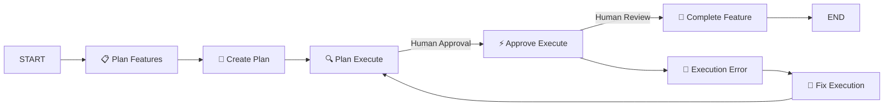

# 🎯 Stratagem Framework

> A Orchestration framework designed for AI-assisted development with Claude

[](https://github.com/tony-thomas-git/stratagem)
[](https://github.com/tony-thomas-git/stratagem)
[](https://claude.ai)

## 🚀 Overview

Stratagem is a strategic project organization framework that transforms chaotic development into disciplined execution. Built specifically for Claude Code integration, it implements a human-in-the-loop workflow ensuring AI assistance with human oversight at critical decision points.

### Key Features

- 🎖️ **Agile-Inspired Hierarchy** - Epics, Campaigns, Tactics structure
- 🔄 **State Machine Workflow** - Clear progression from planning to execution
- 👤 **Human Checkpoints** - Mandatory approval gates before code execution
- 📊 **Progress Tracking** - Real-time task completion monitoring
- 🤖 **AI-First Design** - Optimized for Claude Code integration

## 📁 Project Structure

```
stratagem/
├── epics/        # Major feature stories (strategic level)
├── campaigns/    # Sprint plans & roadmaps (operational level)
├── tactics/      # Bug fixes & quick wins (tactical level)
├── intel/        # Research, specs, decisions
├── watchlist/    # Risks and monitoring
└── templates/    # Reusable document templates
```

## 🔄 Workflow States

The Stratagem workflow implements a sophisticated state machine:



### Command Modes

| Mode | Name | Purpose | Human Gate |
|------|------|---------|------------|
| PF | Plan Features | Define what to build | No |
| CP | Create Plan | Generate task breakdown | No |
| PX | Plan Execute | Select task & strategy | **Yes - Approval** |
| AX | Approve Execute | Implement approved plan | **Yes - Review** |
| XE | Execution Error | Identify issues | No |
| FX | Fix Execution | Resolve errors | No |
| CF | Complete Feature | Finalize & document | No |
| RP | Read Plan | Resume existing work | No |

## 🏃 Quick Start

### 1. Initialize a New Feature

```bash
# Create a new epic
mkdir -p epics
echo "# 1.authentication-system" > epics/1.authentication-system.md

# Start planning
claude-code PF "Create user authentication system"
```

### 2. Execute the Workflow

```bash
# Create detailed plan
claude-code CP

# Begin execution loop
claude-code PX  # Select next task
# 👤 Human: Review and approve plan
claude-code AX  # Execute approved plan
# 👤 Human: Review implementation
# Repeat until all tasks complete

# Complete the feature
claude-code CF
```

### 3. Resume Work

```bash
# Pick up where you left off
claude-code RP
claude-code PX  # Continue with next task
```

## 📋 File Naming Convention

Stratagem enforces a hierarchical prefixing system:

- `1.` - Epic level (major features)
- `1.1.` - Feature/Story level
- `1.1.1.` - Task level

### Examples

```
epics/
├── 1.authentication-system.md
├── 2.payment-processing.md

campaigns/
├── 1.1.user-registration.md
├── 1.2.login-flow.md

tactics/
├── 1.1.1.fix-email-validation.md
├── 1.1.2.add-password-strength.md
```

## 📄 Plan.md Structure

Each feature generates a structured plan file:

```markdown
# Feature: User Authentication
Created: 2025-01-25 14:30
Status: In Progress (3/7 tasks)

## Task List
- [ ] Task 1: Set up database schema
- [ ] Task 2: Create registration API
- [x] Task 3: Implement password hashing ✅ 15:02
- [ ] Task 4: Build login endpoint

## Implementation Notes
- Using PostgreSQL with bcrypt
- Following OWASP guidelines
```

## 🛠️ Installation

```bash
# Clone the repository
git clone https://github.com/yourusername/stratagem.git
cd stratagem

# Create directory structure
./setup.sh

# Install Claude Code extension
# (Instructions for your IDE)
```

## 🤝 Contributing

We welcome contributions! Please see our [Contributing Guide](CONTRIBUTING.md) for details.

### Development Workflow

1. Fork the repository
2. Create your feature branch (`git checkout -b epic/amazing-feature`)
3. Commit atomically (`git commit -m '[PX] Add amazing feature'`)
4. Push to branch (`git push origin epic/amazing-feature`)
5. Open a Pull Request

## 📊 Project Status

- ✅ **Core Workflow** - Complete and tested
- ✅ **Human Checkpoints** - Implemented
- ✅ **Visual Documentation** - SVG workflow diagram
- 🚧 **Automation Scripts** - In development
- 📅 **Web Dashboard** - Planned

## 🗺️ Roadmap

### Version 3.1 (Current Sprint)
- [ ] Automated file organization
- [ ] Progress tracking dashboard
- [ ] Template instantiation

### Version 4.0 (Next Release)
- [ ] Web-based workflow visualizer
- [ ] Multi-project orchestration
- [ ] Performance metrics

### Future Vision
- Team collaboration features
- CI/CD pipeline integration

## 📚 Documentation

- [Architecture Overview](docs/Stratagem%20Architecture.md)
- [Workflow Checklist](docs/v3/stratagem-workflow-checklist.md)
- [As-Built Documentation](docs/as-built-7-25-25.md)

#
---

<p align="center">
  <strong>🎯 Strategic Planning + 🤖 AI Execution + 👤 Human Wisdom = 🚀 Success</strong>
</p>

<p align="center">
  Made with ❤️ and strategic thinking
</p>
